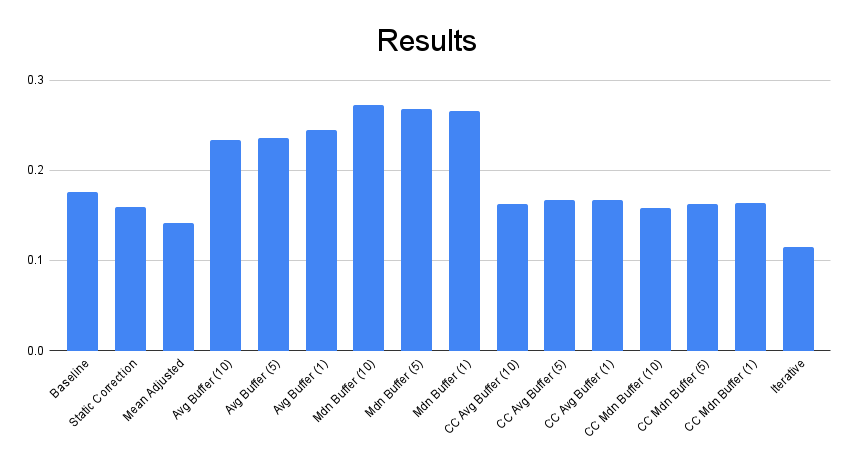

# Projector Correction Project
#### Kincannon Wilson, James Wedum, Nithin Weerasinghe

### Presentation Slides
[View the presentation slides here!](./ProjCorrPres.pdf)

### Github Repo
[View the GitHub repo here!](./)

### Intro
  Problem: Physical projection image quality is highly dependent on environmental factors. These factors include, but are not limited to: ambient lighting, surface color and texture, vibrations and impacts, and physical placement. These factors can not always be presumed to be static in the environment, for example significant scene changes can effect global illumination, resulting in color and luminosity pertubations. The project aims to develop and evaluate methodologies for improving the quality of projected images by dynamically adapting to environmental factors in order to create an application capable of intelligently enhancing projected image quality.

Current projectors utilize basic color correction algorithms and smooth screens to enhance image quality, but they don't effectively address changing environmental conditions like surface texture or dynamic factors such as moving screens or shifting lighting. Past research often relies on specialized hardware or algorithms, limiting accessibility. Our project proposes a dynamic correction system that adapts to environmental changes using only a camera, projector, and computer connected via HDMI, eliminating the need for specialized hardware like GPUs or constant user input.

### Methodology (method, data, evaluation metrics). If applicable, highlight how it differs from prior work (new experiments, new methods, etc)
#### Method
We developed a reactive-adaptive system that primarily functions using multiple feedback loops in cascade, complemented by a pseudo-feed-forward component. The feed forward component consists of two functions: the calculation and application of a homography matrix to correct for sheer, and a low-pass filter for determining a color delta.We employ the pseudo-feed-forward mechanism to control optical blur and focus adjustment. This mechanism initially operates based on visual feedback followed by feedback from an encoder to operate a PD (Proportional-Derivative) controller, achieving a steady state after settling. Once in this state, it does not react again unless reactivation is specified by the user, allowing the mechanism to function predominantly as a feed-forward component throughout most of the operation cycle.

The color delta application utilizes a low-pass average filter on a buffer of per-frame pixel-wise color deltas. This is calculated from individual captured frames. We expect some level of ghosting, based on the buffer size. That is, there may be an after-image from portions of the scene that are in-frame for extended periods of time. Character and scene transitions are our high-frequency portion of the data. Given some window, a number on non-static elements are expected in the image due to motion and scene change. The low-pass filter seeks to attenuate this information by averaging together many distinctly different frame deltas. This should result in primarily low-frequecny information regarding color and luminosity to be retained in the filter, such as those resulting from the pysical characteristics of the projection space.

- Reactive-Adaptive Control System
  - Feed-forward controller for image shape
  - Feed-back controller for color correction
- Low-pass filter
  - Attenuate high-frequency information (such as motion)
  - Focus on low-frequency delta (background/environment color)
- PD controller for motor with rotary encoder for real-time focus adjustment
  - Potential correction for rapid perturbations, such as the projector being struck
- Single-sensor, low-cost option
  - Dual-sensor with rotary encoder

#### Limitations

#### Data
For testing purposes, we used 75 frames from *The Wolf of Wall Street (2013)*.

#### Evaluation Metrics
We propose a single primary evaluation metric for our experiments, the normalized pixel-wise MAE (Mean Absolute Error). The value is the normalized distance between a recorded image and the actual image produced on the computer. We calculate this metric by taking the absolute difference between the two images’ intensities and dividing by the maximum possible difference between two images of that size to obtain a result in the range of 0 to 1, inclusive; with value of 1 suggesting maximum dissimilarity and a value of 0 corresponding to an exact match.

Upon post-mortem review, we recognized that the single metric may not have been fully sufficient. One weakness is that it is insensitive to image artifacts that would be very noticeable to the average human viewer, leading to certain types of corruption not being properly accounted for. Additionally, prior work often utilized user studies to corroborate their results by having participants compare the resulting projection against a control or other techniques. Given our time and resource constraints, we were not able to conduct such trials.

### Discussion of quantitative results
[This folder](./results) contains the results of our experiments for the project. We ran an initial test with the projector system with a blue screen that you can see at blue_screen_correction.png. We ran a test on how well the system would respond to an irregular surface in front of the target projection surface at diff_test_results. And finally you can see the graph evaluating the distance metrics generated by the various methods we employed below.

The iterative approach gave the best result, but upon closer inspection, the result has artifacts that reveals the difficulty of using our distance metric and the difficulty of aligning a camera input to what humans actually see. 
### Demos
Here is a demo of the iterative timelapse. More demos can be viewed [here](./videos)

